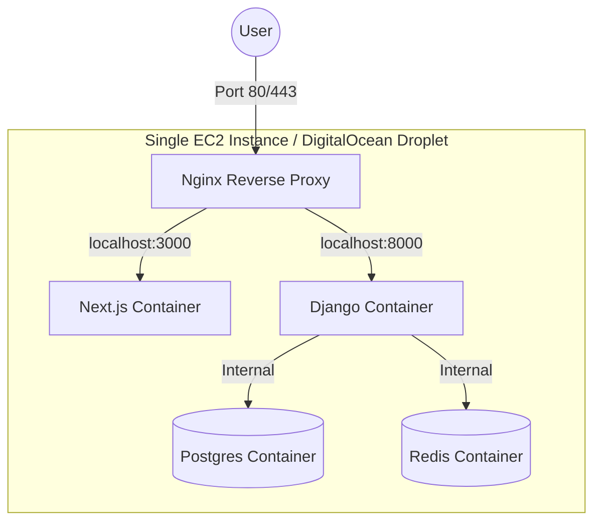
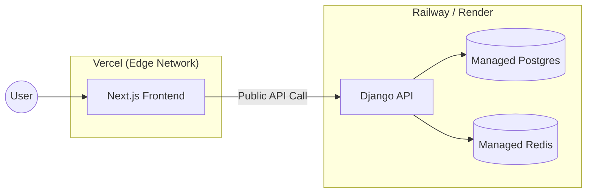
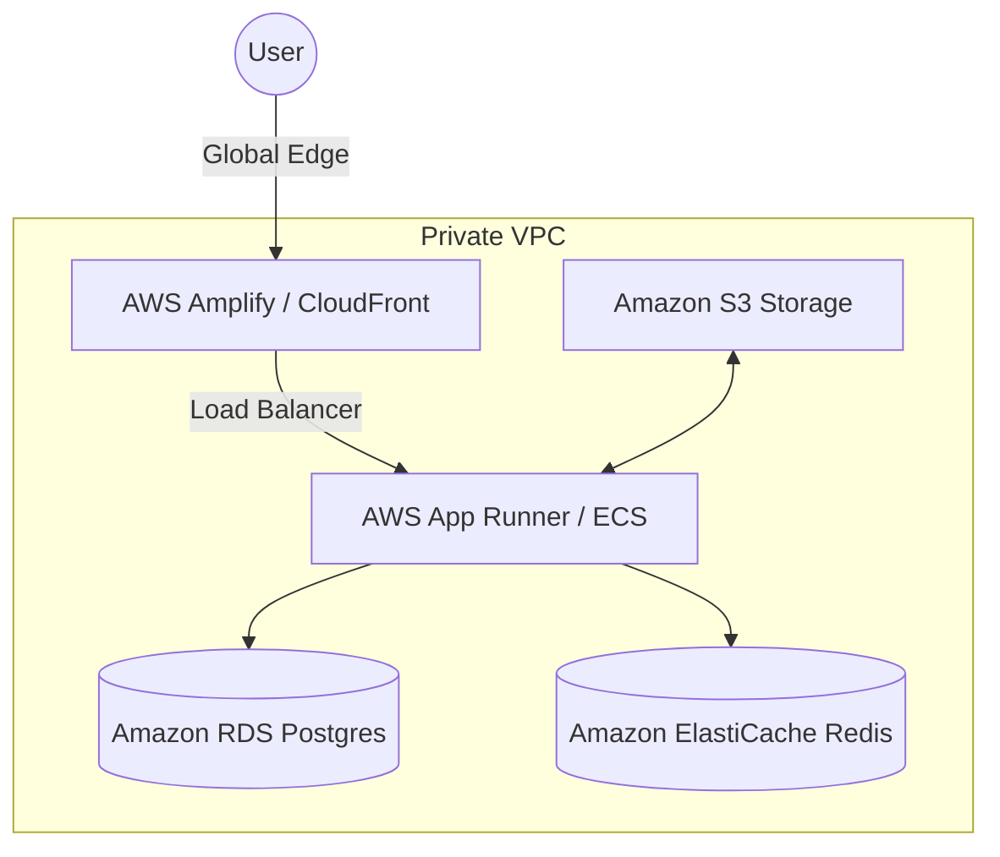

## 1. `docs/architecture.md`

### *Chapter: The Blueprint of a Scalable Housing Portal*

#### 1.1 Introduction

The "Housing Caching Demo" is designed to simulate a high-traffic real estate marketplace. In such systems, the read-to-write ratio is often 100:1. Users spend hours searching and filtering, while property updates happen infrequently. This makes it the perfect candidate for a multi-layered caching strategy.

#### 1.2 The System Components

* **The Persistence Layer (PostgreSQL):** Chosen for its robust support of complex relational queries and indexing. In this project, it acts as the "Single Source of Truth."
* **The Cache Layer (Redis):** An in-memory data store used to alleviate the load on PostgreSQL. We use it for storing expensive API responses and session metadata.
* **The Backend API (Django + DRF):** Handles business logic, authentication, and database abstraction. It is designed to be "stateless" to allow horizontal scaling.
* **The Frontend UI (Next.js):** Utilizes the App Router to implement both Server-Side Rendering (SSR) and Client-Side Rendering (CSR), allowing us to demonstrate edge caching and request memoization.

#### 1.3 Communication Protocol

1. **Client-to-Frontend:** Standard HTTPS.
2. **Frontend-to-Backend:** Internal Docker networking (`http://backend:8000`). This reduces latency and keeps the API internal where possible.
3. **Backend-to-Services:** Django communicates with Postgres (Port 5432) and Redis (Port 6379) over the virtual bridge network created by Docker Compose.

---

To make your documentation truly "book-grade," we should categorize the deployment models into three distinct tiers: **Monolithic (Cost-Optimized)**, **Decoupled SaaS (Speed-Optimized)**, and **Cloud-Native (Enterprise-Scale)**.

I have updated the architecture descriptions and included Mermaid diagrams for each. You can add these directly to your `docs/architecture.md`.

---

# Deployment Evolution

## 1. The Monolithic Container Model (EC2 / VPS)

This is the closest to your local development environment. Everything—the frontend, backend, database, and cache—lives inside a single virtual machine managed by Docker Compose.

* **Best For:** MVPs, low-budget side projects, and simple deployments.
* **Workflow:** You `ssh` into the server, `git pull`, and run `docker compose up -d`.
* **Limitation:** If the server runs out of RAM (e.g., during a heavy Redis operation), the entire site goes down.

---

## 2. The Decoupled SaaS Model (Vercel + Railway/Render)

This is the most popular choice for modern developers. You delegate the "hard stuff" (scaling and database maintenance) to specialized platforms.

* **Best For:** High-performance blogs or SaaS apps where you want the frontend to be "at the edge" (near the user).
* **Workflow:** Automatic deployment on `git push`. Vercel builds the frontend; Railway builds the backend Dockerfile.
* **Optimization:** This leverages Vercel's global CDN, meaning your housing images and pages load instantly regardless of user location.

---

## 3. The Enterprise Cloud-Native Model (AWS)

This is how massive platforms like Zillow or Airbnb are architected. Every component is isolated and can scale independently.

* **Best For:** Production systems with high traffic and strict security requirements.
* **Workflow:** Infrastructure as Code (Terraform/CDK) manages the environment.
* **Key Advantage:** The database and Redis are hidden inside a **Private VPC**, meaning they are not accessible from the open internet, making this the most secure model.

---

